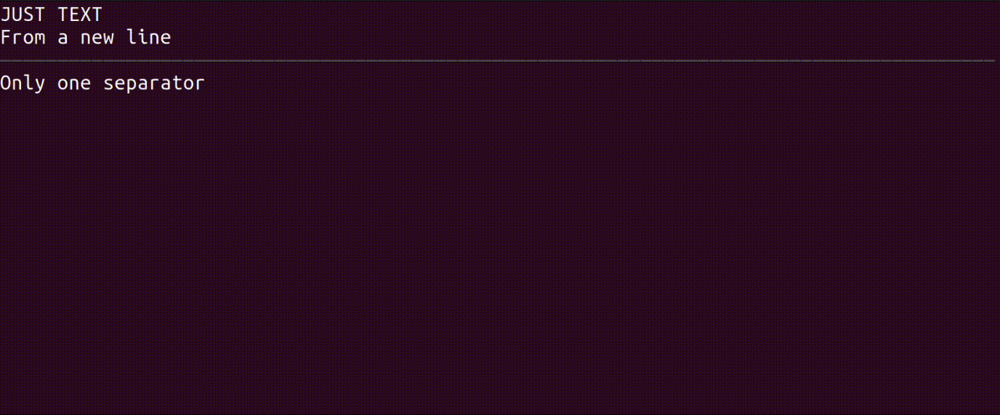

# Logion

<p align="center">
  <br>
  <b>Logion allows you to output beautiful logs to a console (TTY) - from different parts of the program - use separators, indents, spinners and style your text.</b>
</p>

## Install

Install via `yarn add logion` | `npm install logion`.

## Usage

Create instance:

```js
import Logion from 'logion';

const logger = new Logion(opts);
```

Logion comes with an easy to use composable API that supports chaining:

```js
logger
  .text('Hello World!')
  .newline(2)
  .text('Good job', 'success')
  .separate()
  .line('One liner')
  .spinner('oh', 'Beatifull spinner');
```

## API

<a name="module_logion"></a>

## logion

* [logion](#module_logion)
    * [module.exports](#exp_module_logion--module.exports) ⏏
        * _static_
            * [.Logion](#module_logion--module.exports.Logion)
                * [new exports.Logion(options)](#new_module_logion--module.exports.Logion_new)
                * [.width](#module_logion--module.exports.Logion+width) ⇒ <code>number</code>
                * [.height](#module_logion--module.exports.Logion+height) ⇒ <code>number</code>
                * [.disabled](#module_logion--module.exports.Logion+disabled) ⇒ <code>boolean</code>
                * [.paused](#module_logion--module.exports.Logion+paused) ⇒ <code>boolean</code>
                * [.styleNames](#module_logion--module.exports.Logion+styleNames) ⇒ <code>object</code>
                * [.newline([num], [force], [identifier])](#module_logion--module.exports.Logion+newline) ⇒ <code>Instance</code>
                * [.indent([num], [identifier])](#module_logion--module.exports.Logion+indent) ⇒ <code>Instance</code>
                * [.separate([color], [char], [identifier])](#module_logion--module.exports.Logion+separate) ⇒ <code>Instance</code>
                * [.text([string], styles, [identifier])](#module_logion--module.exports.Logion+text) ⇒ <code>Instance</code>
                * [.style(string, styles, [identifier])](#module_logion--module.exports.Logion+style) ⇒ <code>string</code>
                * [.styleReset(string)](#module_logion--module.exports.Logion+styleReset) ⇒ <code>string</code>
                * [.line([string], [styles], [indt])](#module_logion--module.exports.Logion+line) ⇒ <code>Instance</code>
                * [.clear()](#module_logion--module.exports.Logion+clear) ⇒ <code>Instance</code>
                * [.spinner(identifier, [text], [config])](#module_logion--module.exports.Logion+spinner) ⇒ <code>Instance</code>
                * [.spinnerDone(identifier, [config])](#module_logion--module.exports.Logion+spinnerDone) ⇒ <code>Instance</code>
                * [.spinnerDoneAll([config])](#module_logion--module.exports.Logion+spinnerDoneAll) ⇒ <code>Instance</code>
                * [.beep()](#module_logion--module.exports.Logion+beep) ⇒ <code>Instance</code>
                * [.waitInteraction([text], [config])](#module_logion--module.exports.Logion+waitInteraction) ⇒ <code>Promise.&lt;Instance&gt;</code>
                * [.log(string, [identifier])](#module_logion--module.exports.Logion+log) ⇒ <code>Instance</code>
                * [.removeLog(identifier)](#module_logion--module.exports.Logion+removeLog) ⇒ <code>Instance</code>
                * [.enable()](#module_logion--module.exports.Logion+enable) ⇒ <code>Instance</code>
                * [.disable()](#module_logion--module.exports.Logion+disable) ⇒ <code>Instance</code>
                * [.resume()](#module_logion--module.exports.Logion+resume) ⇒ <code>Instance</code>
                * [.pause()](#module_logion--module.exports.Logion+pause) ⇒ <code>Instance</code>
        * _inner_
            * [~Instance](#module_logion--module.exports..Instance) : <code>object</code>
            * [~styleName](#module_logion--module.exports..styleName) : <code>&quot;success&quot;</code> \| <code>&quot;error&quot;</code> \| <code>&quot;info&quot;</code> \| <code>&quot;bold&quot;</code> \| <code>&quot;underline&quot;</code> \| <code>&quot;italic&quot;</code> \| <code>&quot;strikethrough&quot;</code>
            * [~color](#module_logion--module.exports..color) : <code>&quot;black&quot;</code> \| <code>&quot;red&quot;</code> \| <code>&quot;green&quot;</code> \| <code>&quot;yellow&quot;</code> \| <code>&quot;blue&quot;</code> \| <code>&quot;magenta&quot;</code> \| <code>&quot;cyan&quot;</code> \| <code>&quot;white&quot;</code> \| <code>&quot;gray&quot;</code> \| <code>&quot;blackBright&quot;</code> \| <code>&quot;redBright&quot;</code> \| <code>&quot;greenBright&quot;</code> \| <code>&quot;yellowBright&quot;</code> \| <code>&quot;blueBright&quot;</code> \| <code>&quot;magentaBright&quot;</code> \| <code>&quot;cyanBright&quot;</code> \| <code>&quot;whiteBright&quot;</code>
            * [~spinnerFormatDone](#module_logion--module.exports..spinnerFormatDone) ⇒ <code>string</code>

<a name="exp_module_logion--module.exports"></a>

### module.exports ⏏
Class representing a logger.

**Kind**: Exported member  
<a name="module_logion--module.exports.Logion"></a>

#### module.exports.Logion
Class representing a logger.

**Kind**: static class of [<code>module.exports</code>](#exp_module_logion--module.exports)  

* [.Logion](#module_logion--module.exports.Logion)
    * [new exports.Logion(options)](#new_module_logion--module.exports.Logion_new)
    * [.width](#module_logion--module.exports.Logion+width) ⇒ <code>number</code>
    * [.height](#module_logion--module.exports.Logion+height) ⇒ <code>number</code>
    * [.disabled](#module_logion--module.exports.Logion+disabled) ⇒ <code>boolean</code>
    * [.paused](#module_logion--module.exports.Logion+paused) ⇒ <code>boolean</code>
    * [.styleNames](#module_logion--module.exports.Logion+styleNames) ⇒ <code>object</code>
    * [.newline([num], [force], [identifier])](#module_logion--module.exports.Logion+newline) ⇒ <code>Instance</code>
    * [.indent([num], [identifier])](#module_logion--module.exports.Logion+indent) ⇒ <code>Instance</code>
    * [.separate([color], [char], [identifier])](#module_logion--module.exports.Logion+separate) ⇒ <code>Instance</code>
    * [.text([string], styles, [identifier])](#module_logion--module.exports.Logion+text) ⇒ <code>Instance</code>
    * [.style(string, styles, [identifier])](#module_logion--module.exports.Logion+style) ⇒ <code>string</code>
    * [.styleReset(string)](#module_logion--module.exports.Logion+styleReset) ⇒ <code>string</code>
    * [.line([string], [styles], [indt])](#module_logion--module.exports.Logion+line) ⇒ <code>Instance</code>
    * [.clear()](#module_logion--module.exports.Logion+clear) ⇒ <code>Instance</code>
    * [.spinner(identifier, [text], [config])](#module_logion--module.exports.Logion+spinner) ⇒ <code>Instance</code>
    * [.spinnerDone(identifier, [config])](#module_logion--module.exports.Logion+spinnerDone) ⇒ <code>Instance</code>
    * [.spinnerDoneAll([config])](#module_logion--module.exports.Logion+spinnerDoneAll) ⇒ <code>Instance</code>
    * [.beep()](#module_logion--module.exports.Logion+beep) ⇒ <code>Instance</code>
    * [.waitInteraction([text], [config])](#module_logion--module.exports.Logion+waitInteraction) ⇒ <code>Promise.&lt;Instance&gt;</code>
    * [.log(string, [identifier])](#module_logion--module.exports.Logion+log) ⇒ <code>Instance</code>
    * [.removeLog(identifier)](#module_logion--module.exports.Logion+removeLog) ⇒ <code>Instance</code>
    * [.enable()](#module_logion--module.exports.Logion+enable) ⇒ <code>Instance</code>
    * [.disable()](#module_logion--module.exports.Logion+disable) ⇒ <code>Instance</code>
    * [.resume()](#module_logion--module.exports.Logion+resume) ⇒ <code>Instance</code>
    * [.pause()](#module_logion--module.exports.Logion+pause) ⇒ <code>Instance</code>

<a name="new_module_logion--module.exports.Logion_new"></a>

##### new exports.Logion(options)
Create a logger.

**Returns**: <code>Instance</code> - a logger instance.  

| Param | Type | Default | Description |
| --- | --- | --- | --- |
| options | <code>object</code> |  | Options object. |
| [options.streamIn] | <code>object</code> | <code>process.stdin</code> | Input stream (for scrolling and shortcuts). |
| [options.streamOut] | <code>object</code> | <code>process.stdout</code> | Output stream. |
| [options.disabled] | <code>boolean</code> | <code>auto</code> | Is logger disabled (no logging). By default, disabled if not ran in TTY. |
| [options.paused] | <code>boolean</code> | <code>false</code> | Is logger paused (not outputting to console and not listening for key presses, but still collecting logs). |
| [options.renderInterval] | <code>number</code> | <code>80</code> | Render interval in ms to update spinners. |
| [options.spinnerColor] | <code>color</code> | <code>white</code> | Spinner char [color](#module_logion--module.exports..color). |
| [options.spinnerIndent] | <code>number</code> | <code>0</code> | Spinner indent length in text chars. |
| [options.spinnerFrames] | <code>Array.&lt;string&gt;</code> | <code>[&quot;⠋&quot;, &quot;⠙&quot;, &quot;⠹&quot;, &quot;⠸&quot;, &quot;⠼&quot;, &quot;⠴&quot;, &quot;⠦&quot;, &quot;⠧&quot;, &quot;⠇&quot;, &quot;⠏&quot;]</code> | Spinner frames characters. |
| [options.spinnerDoneChar] | <code>string</code> | <code>&quot;✱&quot;</code> | Char to replace spinner after it is done (when calling [spinnerDone](#module_logion--module.exports.Logion+spinnerDone)). |
| [options.spinnerDoneAllChar] | <code>string</code> | <code>&quot;✸&quot;</code> | Char to replace active spinners after they are done (when calling [spinnerDoneAll](#module_logion--module.exports.Logion+spinnerDoneAll)). |
| [options.spinnerFormatDone] | <code>function</code> | <code>(str) &#x3D;&gt; str</code> | Call this function to format the spinner text after it is done, see [spinnerFormatDone](#module_logion--module.exports..spinnerFormatDone). |

<a name="module_logion--module.exports.Logion+width"></a>

##### logion.width ⇒ <code>number</code>
Width of a console.

**Kind**: instance property of [<code>Logion</code>](#module_logion--module.exports.Logion)  
**Returns**: <code>number</code> - width in chars.  
**Read only**: true  
<a name="module_logion--module.exports.Logion+height"></a>

##### logion.height ⇒ <code>number</code>
Height of a console.

**Kind**: instance property of [<code>Logion</code>](#module_logion--module.exports.Logion)  
**Returns**: <code>number</code> - height in chars.  
**Read only**: true  
<a name="module_logion--module.exports.Logion+disabled"></a>

##### logion.disabled ⇒ <code>boolean</code>
Returns true if a logger is disabled.

**Kind**: instance property of [<code>Logion</code>](#module_logion--module.exports.Logion)  
**Returns**: <code>boolean</code> - is disabled.  
**Read only**: true  
<a name="module_logion--module.exports.Logion+paused"></a>

##### logion.paused ⇒ <code>boolean</code>
Returns true if a logger is paused.

**Kind**: instance property of [<code>Logion</code>](#module_logion--module.exports.Logion)  
**Returns**: <code>boolean</code> - is paused.  
**Read only**: true  
<a name="module_logion--module.exports.Logion+styleNames"></a>

##### logion.styleNames ⇒ <code>object</code>
Shortening style names enum.
See [Available style names](#module_logion--module.exports..styleName)

**Kind**: instance property of [<code>Logion</code>](#module_logion--module.exports.Logion)  
**Returns**: <code>object</code> - style names enum.  
**Read only**: true  
<a name="module_logion--module.exports.Logion+newline"></a>

##### logion.newline([num], [force], [identifier]) ⇒ <code>Instance</code>
Output a newline(s).
Accommodates if line breaks have been used before.

**Kind**: instance method of [<code>Logion</code>](#module_logion--module.exports.Logion)  
**Returns**: <code>Instance</code> - a logger instance.  

| Param | Type | Default | Description |
| --- | --- | --- | --- |
| [num] | <code>number</code> | <code>1</code> | Number of new lines to output. |
| [force] | <code>boolean</code> | <code>false</code> | Do not accommodate for previous lines. |
| [identifier] | <code>string</code> | <code>&quot;$random&quot;</code> | Identifier for this log message (should be unique). |

<a name="module_logion--module.exports.Logion+indent"></a>

##### logion.indent([num], [identifier]) ⇒ <code>Instance</code>
Output spaces.
Can be used in the middle of a line.

**Kind**: instance method of [<code>Logion</code>](#module_logion--module.exports.Logion)  
**Returns**: <code>Instance</code> - a logger instance.  

| Param | Type | Default | Description |
| --- | --- | --- | --- |
| [num] | <code>number</code> | <code>2</code> | Number of spaces to output. |
| [identifier] | <code>string</code> | <code>&quot;$random&quot;</code> | Identifier for this log message (should be unique). |

<a name="module_logion--module.exports.Logion+separate"></a>

##### logion.separate([color], [char], [identifier]) ⇒ <code>Instance</code>
Output a separator on a new line.
It fills all the available width.

**Kind**: instance method of [<code>Logion</code>](#module_logion--module.exports.Logion)  
**Returns**: <code>Instance</code> - a logger instance.  

| Param | Type | Default | Description |
| --- | --- | --- | --- |
| [color] | <code>color</code> | <code>grey</code> | A separator character's [color](#module_logion--module.exports..color). |
| [char] | <code>string</code> | <code>&quot;-&quot;</code> | Character that make up the separator. |
| [identifier] | <code>string</code> | <code>&quot;$random&quot;</code> | Identifier for this log message (should be unique). |

<a name="module_logion--module.exports.Logion+text"></a>

##### logion.text([string], styles, [identifier]) ⇒ <code>Instance</code>
Output a text with stlies applied.
Does not add a new line.

**Kind**: instance method of [<code>Logion</code>](#module_logion--module.exports.Logion)  
**Returns**: <code>Instance</code> - a logger instance.  

| Param | Type | Default | Description |
| --- | --- | --- | --- |
| [string] | <code>string</code> | <code>&quot;$space&quot;</code> | Text to output. |
| styles | <code>object</code> \| <code>styleName</code> |  | Style object or [styleName](#module_logion--module.exports..styleName) string. |
| [styles.color] | <code>color</code> |  | Text color (uses Chalk module [color](#module_logion--module.exports..color)). |
| [styles.bgColor] | <code>color</code> |  | Background color (uses Chalk [color](#module_logion--module.exports..color)). |
| [styles.bold] | <code>boolean</code> | <code>false</code> | Output as bold. |
| [styles.underline] | <code>boolean</code> | <code>false</code> | Output as underlined. |
| [styles.italic] | <code>boolean</code> | <code>false</code> | Output as italic. |
| [styles.strikethrough] | <code>boolean</code> | <code>false</code> | Output as strike-through. |
| [identifier] | <code>string</code> | <code>&quot;$random&quot;</code> | Identifier for this log message (should be unique). |

<a name="module_logion--module.exports.Logion+style"></a>

##### logion.style(string, styles, [identifier]) ⇒ <code>string</code>
Style a text string.
Shortening names could be one of: "success", "error", "info", "bold", "underline", "italic", "strikethrough".

**Kind**: instance method of [<code>Logion</code>](#module_logion--module.exports.Logion)  
**Returns**: <code>string</code> - a styled string (with escape codes).  

| Param | Type | Default | Description |
| --- | --- | --- | --- |
| string | <code>string</code> |  | Text to style. |
| styles | <code>object</code> \| <code>styleName</code> |  | Style object or [styleName](#module_logion--module.exports..styleName) string. |
| [styles.color] | <code>color</code> |  | Text color (uses Chalk module [color](#module_logion--module.exports..color)). |
| [styles.bgColor] | <code>color</code> |  | Background color (uses Chalk [color](#module_logion--module.exports..color)). |
| [styles.bold] | <code>boolean</code> | <code>false</code> | Output as bold. |
| [styles.underline] | <code>boolean</code> | <code>false</code> | Output as underlined. |
| [styles.italic] | <code>boolean</code> | <code>false</code> | Output as italic. |
| [styles.strikethrough] | <code>boolean</code> | <code>false</code> | Output as strike-through. |
| [identifier] | <code>string</code> | <code>&quot;$random&quot;</code> | Identifier for this log message (should be unique). |

<a name="module_logion--module.exports.Logion+styleReset"></a>

##### logion.styleReset(string) ⇒ <code>string</code>
Reset all styles for a string.

**Kind**: instance method of [<code>Logion</code>](#module_logion--module.exports.Logion)  
**Returns**: <code>string</code> - an unstyled string.  

| Param | Type | Description |
| --- | --- | --- |
| string | <code>string</code> | String with styled text. |

<a name="module_logion--module.exports.Logion+line"></a>

##### logion.line([string], [styles], [indt]) ⇒ <code>Instance</code>
Output a line of a text with an indent.

**Kind**: instance method of [<code>Logion</code>](#module_logion--module.exports.Logion)  
**Returns**: <code>Instance</code> - a logger instance.  

| Param | Type | Default | Description |
| --- | --- | --- | --- |
| [string] | <code>string</code> | <code>&quot;$space&quot;</code> | Your text. |
| [styles] | <code>object</code> \| <code>string</code> |  | Style object or shortening name (as string), same as [style](#module_logion--module.exports.Logion+style). |
| [styles.color] | <code>color</code> |  | Text color (uses Chalk module [color](#module_logion--module.exports..color)). |
| [styles.bgColor] | <code>color</code> |  | Background color (uses Chalk [color](#module_logion--module.exports..color)). |
| [styles.bold] | <code>boolean</code> | <code>false</code> | Output as bold. |
| [styles.underline] | <code>boolean</code> | <code>false</code> | Output as underlined. |
| [styles.italic] | <code>boolean</code> | <code>false</code> | Output as italic. |
| [styles.strikethrough] | <code>boolean</code> | <code>false</code> | Output as strike-through. |
| [indt] | <code>number</code> | <code>0</code> | Line indentation, a number of spaces to output before the text. |

<a name="module_logion--module.exports.Logion+clear"></a>

##### logion.clear() ⇒ <code>Instance</code>
Clear all the output.

**Kind**: instance method of [<code>Logion</code>](#module_logion--module.exports.Logion)  
**Returns**: <code>Instance</code> - a logger instance.  
<a name="module_logion--module.exports.Logion+spinner"></a>

##### logion.spinner(identifier, [text], [config]) ⇒ <code>Instance</code>
Create a spinner on a new line.
You can mark a spinner as done using its identifier with [spinnerDone](#module_logion--module.exports.Logion+spinnerDone).

**Kind**: instance method of [<code>Logion</code>](#module_logion--module.exports.Logion)  
**Returns**: <code>Instance</code> - a logger instance.  

| Param | Type | Default | Description |
| --- | --- | --- | --- |
| identifier | <code>string</code> |  | Identifier for this spinner (required, should be unique). |
| [text] | <code>string</code> |  | Text to output after this spinner (on the same line). |
| [config] | <code>object</code> |  | An object for configuring this spinner. |
| [config.color] | <code>color</code> | <code>white</code> | Spinner char color (uses Chalk module [color](#module_logion--module.exports..color)). |
| [config.indent] | <code>number</code> | <code>0</code> | Amount of spaces to output before this spinner. |

<a name="module_logion--module.exports.Logion+spinnerDone"></a>

##### logion.spinnerDone(identifier, [config]) ⇒ <code>Instance</code>
Mark the spinner as done.
If text is not provided, uses [spinnerFormatDone](#module_logion--module.exports..spinnerFormatDone) to format the original text.

**Kind**: instance method of [<code>Logion</code>](#module_logion--module.exports.Logion)  
**Returns**: <code>Instance</code> - a logger instance.  

| Param | Type | Default | Description |
| --- | --- | --- | --- |
| identifier | <code>string</code> |  | Identifier for the spinner (previously used to create the spinner in [spinner](#module_logion--module.exports.Logion+spinner)). |
| [config] | <code>object</code> |  | An object for configuring this spinner. |
| [config.text] | <code>string</code> |  | A new text for this spinner (if empty, leaves the original text). |
| [config.color] | <code>color</code> |  | A new spinner char [color](#module_logion--module.exports..color) (if empty, uses the original color). |
| [config.char] | <code>string</code> | <code>&quot;✱&quot;</code> | A character which replaces the spinner. |

<a name="module_logion--module.exports.Logion+spinnerDoneAll"></a>

##### logion.spinnerDoneAll([config]) ⇒ <code>Instance</code>
Mark all spinners that are not already done as done.
Uses [spinnerFormatDone](#module_logion--module.exports..spinnerFormatDone) to format the original text.

**Kind**: instance method of [<code>Logion</code>](#module_logion--module.exports.Logion)  
**Returns**: <code>Instance</code> - a logger instance.  

| Param | Type | Default | Description |
| --- | --- | --- | --- |
| [config] | <code>object</code> |  | An object for configuring this spinner. |
| [config.color] | <code>color</code> |  | A new spinner char [color](#module_logion--module.exports..color) (if empty, uses the original color). |
| [config.char] | <code>string</code> | <code>&quot;✸&quot;</code> | A character which replaces the spinner. |

<a name="module_logion--module.exports.Logion+beep"></a>

##### logion.beep() ⇒ <code>Instance</code>
Make a beep sound.
May not be played in some consoles.

**Kind**: instance method of [<code>Logion</code>](#module_logion--module.exports.Logion)  
**Returns**: <code>Instance</code> - a logger instance.  
<a name="module_logion--module.exports.Logion+waitInteraction"></a>

##### logion.waitInteraction([text], [config]) ⇒ <code>Promise.&lt;Instance&gt;</code>
Output a special spinner and waits for a user interaction.
Removes the spinner after interaction and resolves a Promise.

**Kind**: instance method of [<code>Logion</code>](#module_logion--module.exports.Logion)  
**Returns**: <code>Promise.&lt;Instance&gt;</code> - a promise which resolves after user interaction (resolver returns a logger instance).  

| Param | Type | Default | Description |
| --- | --- | --- | --- |
| [text] | <code>string</code> | <code>&quot;Press any key to continue&quot;</code> | Text for the spinner |
| [config] | <code>object</code> |  | An object for configuring the spinner, see [spinner](#module_logion--module.exports.Logion+spinner). |

<a name="module_logion--module.exports.Logion+log"></a>

##### logion.log(string, [identifier]) ⇒ <code>Instance</code>
Log a row string.
Other methods use this under the hood.

**Kind**: instance method of [<code>Logion</code>](#module_logion--module.exports.Logion)  
**Returns**: <code>Instance</code> - a logger instance.  

| Param | Type | Default | Description |
| --- | --- | --- | --- |
| string | <code>string</code> |  | String to output. |
| [identifier] | <code>string</code> | <code>&quot;$random&quot;</code> | Identifier for this log message (should be unique). |

<a name="module_logion--module.exports.Logion+removeLog"></a>

##### logion.removeLog(identifier) ⇒ <code>Instance</code>
Remove a log message with the corresponding identifier.

**Kind**: instance method of [<code>Logion</code>](#module_logion--module.exports.Logion)  
**Returns**: <code>Instance</code> - a logger instance.  

| Param | Type | Description |
| --- | --- | --- |
| identifier | <code>string</code> | Identifier for the log message (used to create it in other methods). |

<a name="module_logion--module.exports.Logion+enable"></a>

##### logion.enable() ⇒ <code>Instance</code>
Enable a logger.

**Kind**: instance method of [<code>Logion</code>](#module_logion--module.exports.Logion)  
**Returns**: <code>Instance</code> - a logger instance.  
<a name="module_logion--module.exports.Logion+disable"></a>

##### logion.disable() ⇒ <code>Instance</code>
Disable a logger.
When disabled, it removes all listeners, resets screen buffer, and clears all logs.

**Kind**: instance method of [<code>Logion</code>](#module_logion--module.exports.Logion)  
**Returns**: <code>Instance</code> - a logger instance.  
<a name="module_logion--module.exports.Logion+resume"></a>

##### logion.resume() ⇒ <code>Instance</code>
Update the console with the last messages, resume spinners and listen for user interactions.
Use this after [pause](#module_logion--module.exports.Logion+pause).

**Kind**: instance method of [<code>Logion</code>](#module_logion--module.exports.Logion)  
**Returns**: <code>Instance</code> - a logger instance.  
<a name="module_logion--module.exports.Logion+pause"></a>

##### logion.pause() ⇒ <code>Instance</code>
Pause all logging, remove all listeners.
Use this to temporary output something outside a logger instance, or to release a process from events listening (by logion).

**Kind**: instance method of [<code>Logion</code>](#module_logion--module.exports.Logion)  
**Returns**: <code>Instance</code> - a logger instance.  
<a name="module_logion--module.exports..Instance"></a>

#### module.exports~Instance : <code>object</code>
A logger instance.

**Kind**: inner typedef of [<code>module.exports</code>](#exp_module_logion--module.exports)  
<a name="module_logion--module.exports..styleName"></a>

#### module.exports~styleName : <code>&quot;success&quot;</code> \| <code>&quot;error&quot;</code> \| <code>&quot;info&quot;</code> \| <code>&quot;bold&quot;</code> \| <code>&quot;underline&quot;</code> \| <code>&quot;italic&quot;</code> \| <code>&quot;strikethrough&quot;</code>
Available style names.

**Kind**: inner typedef of [<code>module.exports</code>](#exp_module_logion--module.exports)  
<a name="module_logion--module.exports..color"></a>

#### module.exports~color : <code>&quot;black&quot;</code> \| <code>&quot;red&quot;</code> \| <code>&quot;green&quot;</code> \| <code>&quot;yellow&quot;</code> \| <code>&quot;blue&quot;</code> \| <code>&quot;magenta&quot;</code> \| <code>&quot;cyan&quot;</code> \| <code>&quot;white&quot;</code> \| <code>&quot;gray&quot;</code> \| <code>&quot;blackBright&quot;</code> \| <code>&quot;redBright&quot;</code> \| <code>&quot;greenBright&quot;</code> \| <code>&quot;yellowBright&quot;</code> \| <code>&quot;blueBright&quot;</code> \| <code>&quot;magentaBright&quot;</code> \| <code>&quot;cyanBright&quot;</code> \| <code>&quot;whiteBright&quot;</code>
Supported color names.

**Kind**: inner typedef of [<code>module.exports</code>](#exp_module_logion--module.exports)  
<a name="module_logion--module.exports..spinnerFormatDone"></a>

#### module.exports~spinnerFormatDone ⇒ <code>string</code>
Format the spinner text when it is marked as done.

**Kind**: inner typedef of [<code>module.exports</code>](#exp_module_logion--module.exports)  
**Returns**: <code>string</code> - a formated spinner text.  

| Type | Description |
| --- | --- |
| <code>string</code> | Current spinner text. |


## TODO

- Add more tests.
- Add a help message for scrolling and document it.
- Add more text style (colors) variants.
- Fix flickering and rerender screen only if needed.
